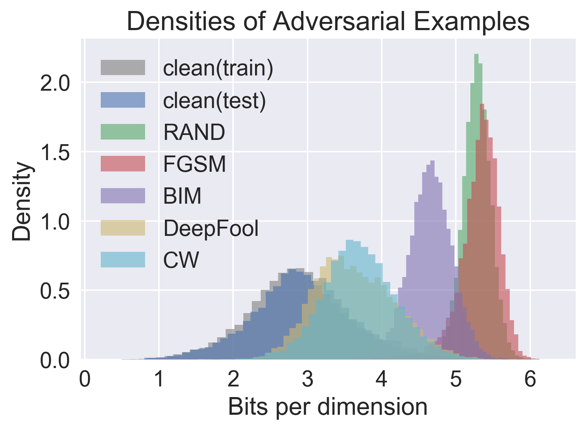
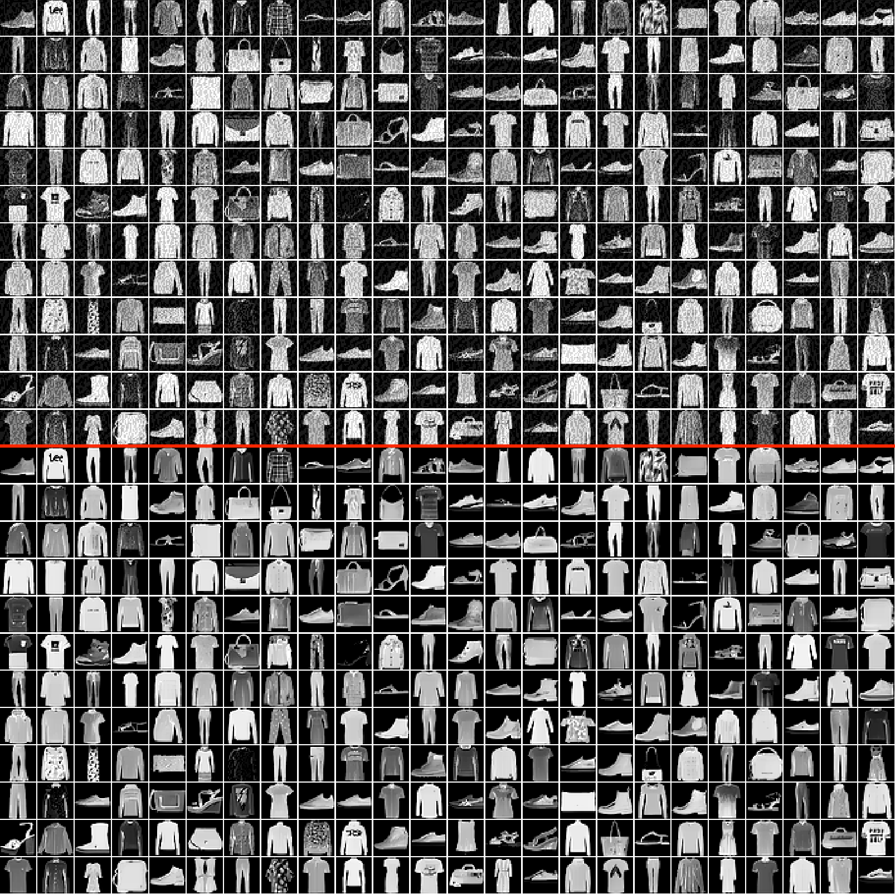
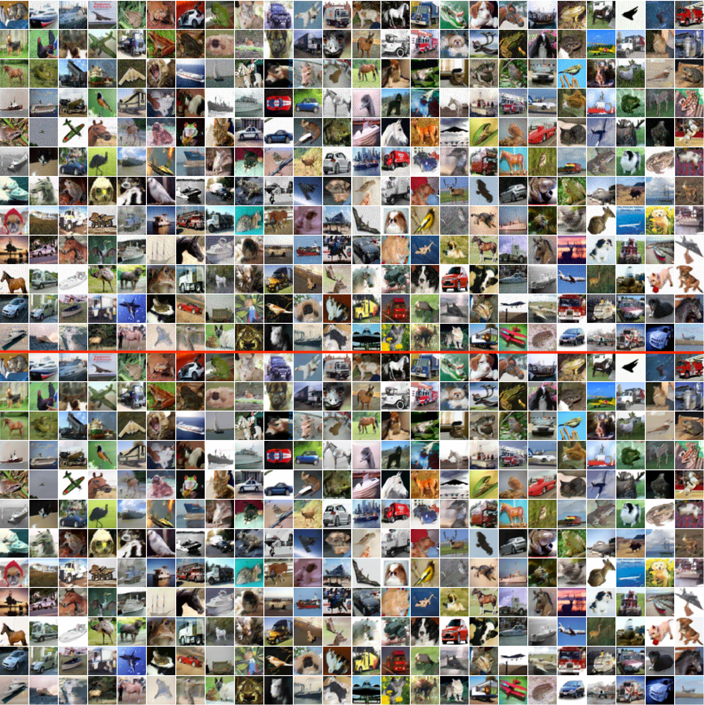

# PixelDefend: Leveraging Generative Models to Understand and Defend against Adversarial Examples

This repo contains necessary code for the paper [PixelDefend: Leveraging Generative Models to Understand and Defend against Adversarial Examples](https://openreview.net/pdf?id=rJUYGxbCW), ICLR 2018.

by [Yang Song](http://yang-song.github.io/), [Taesup Kim](https://sites.google.com/site/taesupkim0813/), [Sebastian Nowozin](http://www.nowozin.net/sebastian/), [Stefano Ermon](https://cs.stanford.edu/~ermon/) and [Nate Kushman](http://www.kushman.org/). It was a joint work of Microsoft Research and Stanford.

---

**PixelDefend** is a model-agonistic and attacker-agonistic method to detect and defend against adversarial examples. Being model-agonistic means it can be applied to any classifier to improve its robustness, while being attacker-agonistic means it can detect and defend against adversarial examples generated by a large range of existing attacks.

## Running Experiments

The code in this repo are capable of doing the following tasks:

- Training PixelCNN++ with softmax cross-entropy losses ([`train_pxpp_softmax.py`](train_pxpp_softmax.py)). In comparison, the original PixelCNN++ uses cross-entropy based on mixtures of logistic distributions.
- Evaluating the bits per dimension under the trained PixelCNN++ for some given dataset ([`eval_pxpp_softmax.py`](eval_pxpp_softmax.py)).
- Generating images from a given softmax PixelCNN++ ([`generate_fast.py`](generate_fast.py)).
- Training and evaluating a ResNet or a VGGNet on some given dataset. Attacking a ResNet or a VGGNet with randomization, FGSM, BIM, CW and DeepFool ([`models_main.py`](models_main.py)).
- Denoising any dataset with a trained PixelCNN++ ([`denoising_fast.py`](denoising_fast.py))

### Dependencies
The code was tested on

```
tensorflow == 1.2.1
cleverhans == 2.0.0
numpy == 1.13.1
scipy == 0.19.1
python == 3.5.2
```

**Note**: The code is based on a specific version of [OpenAI PixelCNN++](https://github.com/openai/pixel-cnn) and it only works on TensorFlow 1.2. For higher versions of TensorFlow, you either need to downgrad TensorFlow to 1.2 or adapt the code appropriately according to the latest PixelCNN++ repo, which should be reasonbly straightforward.

### Folder Structure
The following shows basic folder structure.

```
├── train_pxpp_softmax.py # Training PixelCNN++ with softmax 
├── eval_pxpp_softmax.py  # Evaluating PixelCNN++ with softmax
├── generate_fast.py  # Generating images from a trained PixelCNN++
├── denoising_fast.py     # PixelDefend denoising
├── models_main.py # Training / evaluating classifiers. Performs various adversarial attacks.
└── results
  	├── data # stores various clean / adversarial images
	├── logs # training logs
  	└── weights # stores weights of PixelCNN++ and various classifiers
```

### Training PixelCNN++
You can train a PixelCNN++ with softmax cross-entropy layer with `train_pxpp_softmax.py`. A simplified usage message is

```
usage: train_pxpp_softmax.py [-d DATA_SET] [-g NR_GPU] [-r]
                            
optional arguments:
  -d DATA_SET, --data_set DATA_SET
                        Can be either cifar | f_mnist
  -r, --load_params     
                        Restore training from previous model checkpoint?
  -g NR_GPU, --nr_gpu NR_GPU
                        How many GPUs to distribute the training across?                       
```

For example, if we want to train PixelCNN++ on `FashionMNIST` with 4 GPUs without loading stored parameters, we can use the following command

```
CUDA_VISIBLE_DEVICES=1,2,3,4 python -u train_pxpp_softmax.py --nr_gpu 4 --data_set f_mnist
```
The weights will be stored in folder `results/weights/pxpp`.

### Evaluating Bits per Dimension

You can also load any trained PixelCNN++ and compute bits per dimension of dataset under that model with the following command.

```
usage: eval_pxpp_softmax.py [-d DATA_SET] [-g NR_GPU]                           
                            [--noise_type NOISE_TYPE]

optional arguments:
  -d DATA_SET, --data_set DATA_SET
                        Can be cifar | f_mnist
  -g NR_GPU, --nr_gpu NR_GPU
                        How many GPUs to distribute the training across?
  --noise_type NOISE_TYPE                        
```

Here `NOISE_TYPE` is a folder name in directory `results/data`. After running `eval_pxpp_softmax.py`, a `.npy` file containing bits per dimension of all images in the dataset will be stored in `results/data/NOISE_TYPE`. There is a naming convension for `NOISE_TYPE`:

```
NOISE_TYPE is a string formated as 
DatasetName_ModelName[_fs_|_ls_|_advBIM_]_AttackMethod[_adv_]_epsNumber1[_denoised_]_epsNumber2
Here items within [] are optional. Separator | means only one of them can be chosen
DatasetName can be cifar or f_mnist
ModelName can be resnet or vgg
AttackMethod can be clean or random or FGSM or BIM or deepfool or CW
Number1 is an integer representing the attack eps
Number2 is an integer representing the defense eps
```

Suppose the data is stored in `results/data/f_mnist_resnet_FGSM_eps8`. You can run

```
CUDA_VISIBLE_DEVICES=0 python -u eval_pxpp_softmax.py --noise_type f_mnist_resnet_FGSM_eps8 --data_set f_mnist
```
to evaluate bits per dimension for all images in that dataset. The results will be stored in `results/data/f_mnist_resnet_FGSM_eps8/bits_per_dim.npy`.

### Generating Images

You can generate images by running `generate_fast.py` following

```
usage: generate_fast.py [-b BATCH_SIZE] [-v SAVE_DIR] [-d DATA_SET]

optional arguments:
  -b BATCH_SIZE, --batch_size BATCH_SIZE
                        Number of images to generate simultaneously. Can be as large as 200
  -v SAVE_DIR, --save_dir SAVE_DIR
                        Location to save generated images
  -d DATA_SET, --data_set DATA_SET
                        Dataset to use. Can be cifar | f_mnist
```

The images will be stored in `SAVE_DIR`.

### Denoising a Dataset with PixelDefend
Below is a brief description of `denoising_fast.py`, which is used to purify a dataset stored in folder `results/data/NOISE_TYPE`.

```
usage: denoising_fast.py [-d DATA_SET] [--noise_type NOISE_TYPE] [--eps EPS]

optional arguments:
  -d DATA_SET, --data_set DATA_SET
                        Dataset to use. Can be cifar | f_mnist
  --noise_type NOISE_TYPE
                        Noise type is some folder name in results/data/  
  --eps EPS             The epsilon for denoising image

```
The denoised dataset will be stored in `results/data/NOISE_TYPE_denoised_epsEPS`. For example, if you want to denoise `results/data/cifar_resnet_FGSM_eps8` with denoising `eps=16`, run

```
CUDA_VISIBLE_DEVICES=0 python -u denoising_fast.py --noise_type cifar_resnet_FGSM_eps8
--eps 16 --data_set cifar
```
The denoised dataset will be stored in `results/data/cifar_resnet_FGSM_eps8_denoised_eps16`.

### Training, evaluating and attacking CNNs
Training, evaluation and attacking functionalities are implemented in `models_main.py`, whose usage is briefed as follows

```
usage: models_main.py [--dataset DATASET] [--mode MODE]
                      [--adversarial [ADVERSARIAL]]
                      [--noise_type NOISE_TYPE]
                      [--noadversarial] [--model MODEL]
                      [--input_data_path INPUT_DATA_PATH]
                      [--num_gpus NUM_GPUS] [--maxiter MAXITER]
                      [--eps EPS] [--random [RANDOM]] [--norandom]
                      [--label_smooth [LABEL_SMOOTH]] [--nolabel_smooth]
                      [--feature_squeeze [FEATURE_SQUEEZE]]
                      [--nofeature_squeeze]
                      [--adversarial_BIM [ADVERSARIAL_BIM]]
                      [--noadversarial_BIM] [--adv_std ADV_STD]
                      [--attack_type ATTACK_TYPE]

optional arguments:
  --dataset DATASET     cifar or f_mnist.
  --mode MODE           train or eval or attack.
  --adversarial [ADVERSARIAL]
                        For training models, turning on this flag means
                        adversarial training.For evaluating and attacking
                        models, turning on this flag means loading
                        adversarially trained model
  --noadversarial
  --noise_type NOISE_TYPE
                        Noise type is some folder name in results/data/  
  --model MODEL         resnet | vgg
  --input_data_path INPUT_DATA_PATH
                        Path for input data. Will override the default one
  --num_gpus NUM_GPUS   Number of gpus used for training. (0 or 1)
  --maxiter MAXITER     maximum number of training iterations
  --eps EPS             eps for attacking
  --random [RANDOM]     Turning it on means we want to evaluate randomly
                        perturbed images
  --norandom
  --label_smooth [LABEL_SMOOTH]
                        do label smoothing during training
  --nolabel_smooth
  --feature_squeeze [FEATURE_SQUEEZE]
                        do feature squeezing during evaluation or attack
  --nofeature_squeeze
  --adversarial_BIM [ADVERSARIAL_BIM]
                        do adversarial training with BIM adversarial examples
  --noadversarial_BIM
  --adv_std ADV_STD     standard deviation of eps used for adversarial
                        training
  --attack_type ATTACK_TYPE
                        Specify a list of attacks rather than the whole
                        attack.If None, do all attacks.

```
#### Examples
If you want to train a VGG network on CIFAR-10 with FGSM adversarial training, run

```
CUDA_VISIBLE_DEVICES=0 python -u models_main.py --mode train --model resnet --dataset cifar --adversarial
```

To evaluate a model on some dataset, say, `cifar_resnet_FGSM_eps8`, run

```
CUDA_VISIBLE_DEVICES=0 python -u models_main.py --mode eval --model resnet 
--noise_type cifar_resnet_FGSM_eps8 --dataset cifar
```

Note that **cifar_resnet\_FGSM\_eps8** can be replaced by any _folder name_ in `results/data/`. If you want to evaluate a model after randomly perturbing the input dataset with `eps=n`, you can add two additional options `--random --eps n`.

If you want to attack a vanilla resnet on CIFAR-10 with `eps=16`,  run

```
CUDA_VISIBLE_DEVICES=0 python -u models_main.py --mode attack --model resnet
--eps 16 --dataset cifar
```

To attack an adversarially trained resnet with `eps=16` using FGSM, run

```
CUDA_VISIBLE_DEVICES=0 python -u models_main.py --mode attack --model resnet 
--adversarial --eps 16 --dataset cifar --attack_type FGSM
```

The adversarial examples will be stored in `results/data/`, with a name indicating the attacking method, following the `NOISE_TYPE` naming convention mentioned above.

## Demonstrations
### Detecting Adversarial Examples
Pipeline:

1. Train PixelCNN++ with `train_pxpp_softmax.py`
2. Train Models with `models_main.py --mode train`
3. Attack trained models with `models_main.py --mode attack`
5. Evaluate bits per dimension of adversarial examples with `eval_pxpp_softmax.py`



### Purifying Adversarial Examples
Pipeline:

1. Train PixelCNN++ with `train_pxpp_softmax.py`
2. Train Models with `models_main.py --mode train`
3. Attack trained models with `models_main.py --mode attack`
4. Purify adversarial examples with `denoise_fast.py`




## Citation
If you use this code for your research, please cite our paper:

```
@inproceedings{song2018pixeldefend,
  title={Pixeldefend: Leveraging generative models to understand and defend against adversarial examples},
  author={Song, Yang and Kim, Taesup and Nowozin, Sebastian and Ermon, Stefano and Kushman, Nate},
  booktitle={International Conference on Learning Representations},
  year={2018}
}
```

## References
This code is based on following open-source projects:

* [OpenAI PixelCNN++](https://github.com/openai/pixel-cnn)
* [Fast PixelCNN++](https://github.com/PrajitR/fast-pixel-cnn)
* [CleverHans](https://github.com/tensorflow/cleverhans)
* [TensorFlow Models](https://github.com/tensorflow/models)
* [Towards Evaluating the Robustness of Neural Networks](https://github.com/carlini/nn_robust_attacks)
